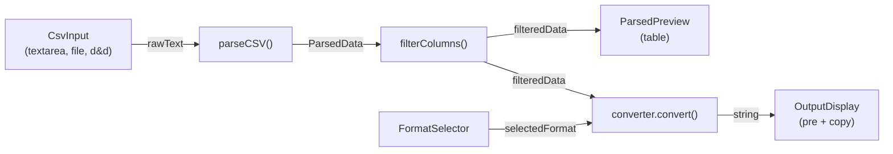

# list_creator — AI Context

## Purpose

Browser app ("CSV List Converter") that accepts CSV-like text (paste, file upload, or drag-and-drop), parses it with a configurable delimiter and header row toggle, lets the user pick columns, previews the table, and converts the filtered data into one of many text formats with copy-to-clipboard output.

Live at: **https://alexsoh.github.io/webapps/list_creator/**

## Tech Stack

- React 19, TypeScript (strict)
- Vite 8 with `@vitejs/plugin-react`
- Tailwind CSS v4 via `@tailwindcss/vite`
- ESLint 9 flat config

## Directory Layout

```
list_creator/
├── .ai/CONTEXT.md          ← this file (git-ignored)
├── index.html               ← shell HTML, loads src/main.tsx
├── package.json             ← scripts: dev, build, lint, preview
├── vite.config.ts           ← base: '/webapps/list_creator/', plugins
├── serve.sh                 ← local build + serve script
├── tsconfig.json            ← solution-style, references app + node
├── tsconfig.app.json        ← src/ config (strict, noEmit)
├── tsconfig.node.json       ← vite.config.ts config
├── eslint.config.js
├── public/
│   ├── favicon.svg
│   └── icons.svg            ← SVG sprite (social icons, not app UI)
└── src/
    ├── main.tsx              ← React entry, mounts App on #root
    ├── App.tsx               ← top-level state + data pipeline
    ├── index.css             ← Tailwind import + @theme CSS variables
    ├── types.ts              ← ParsedData, ConverterFn, ConverterInfo, Delimiter
    ├── utils/
    │   └── csvParser.ts      ← detectDelimiter, parseLine, parseCSV, filterColumns
    ├── components/
    │   ├── CsvInput.tsx      ← textarea, file/drag-drop, delimiter select, header toggle
    │   ├── ColumnSelector.tsx← per-header pill toggles, select/deselect all
    │   ├── ParsedPreview.tsx ← table preview (max 10 rows)
    │   ├── FormatSelector.tsx← format buttons from converter registry
    │   └── OutputDisplay.tsx ← monospace <pre>, copy button, scroll top/bottom buttons
    └── converters/
        ├── index.ts          ← registry: ordered ConverterInfo[] array
        ├── json.ts
        ├── powershell.ts
        ├── sql.ts            ← exports sqlInConverter, sqlInsertConverter, sqlValuesConverter
        ├── markdown.ts
        ├── yaml.ts
        ├── python.ts
        ├── bash.ts
        ├── zsh.ts
        ├── xml.ts
        └── dos.ts
```

## Data Flow



**Pipeline in `App.tsx`:**

1. `CsvInput` updates `rawText`; `detectDelimiter` auto-sets delimiter on change
2. `parseCSV(rawText, delimiter, hasHeaders)` → `ParsedData` (memoized)
3. `useEffect` resets `selectedColumns` to all-true when header count changes
4. `filterColumns(parsed, selectedColumns)` → `filteredData` (memoized)
5. `converter.convert(filteredData)` → output string (memoized); errors → `'// Error generating output'`

## Component Tree

```
App
├── CsvInput(value, onChange, delimiter, onDelimiterChange, hasHeaders, onHasHeadersChange)
├── ColumnSelector(headers, selected, onChange)       ← shown when headers > 1
├── ParsedPreview(data: ParsedData)                   ← shown when rows > 0
├── FormatSelector(selected: string, onChange)         ← shown when rows > 0
└── OutputDisplay(output: string, formatName: string)  ← shown when rows > 0
```

## Type Definitions (`src/types.ts`)

```typescript
interface ParsedData {
  headers: string[];
  rows: string[][];
  hasHeaders: boolean;
}

type ConverterFn = (data: ParsedData, options?: Record<string, unknown>) => string;

interface ConverterInfo {
  name: string;        // display name for UI button
  id: string;          // stable identifier
  convert: ConverterFn;
  description: string; // button tooltip
}

type Delimiter = ',' | '\t' | '|' | string;
```

## Converter Registry Pattern

The most common change is adding a new output format. Steps:

1. Create `src/converters/myformat.ts`
2. Import `ConverterInfo` and `ParsedData` from `../types`
3. Write a pure `convert(data: ParsedData): string` function
4. Export a `ConverterInfo` object: `{ id, name, description, convert }`
5. In `src/converters/index.ts`: import it and add to the `converters` array

The array order determines: button order in `FormatSelector`, and the default format (`converters[0]` = JSON). No other files need changes — the UI reads from the registry dynamically.

### Converter Behavior Summary

Convention: `headers.length <= 1` is "single-column mode" for formats that distinguish.

| Converter | id | Columns Used | Escaping |
|---|---|---|---|
| JSON | `json` | Single: string array from `r[0]`; Multi: array of objects | `JSON.stringify` |
| PowerShell | `powershell` | Single: `@('a','b')`; Multi: `@{ prop = 'val' }` array | `'` → `''` |
| SQL IN | `sql-in` | First column only: `('a','b')` | `'` → `''` |
| SQL INSERT | `sql-insert` | All columns, one INSERT per row | `'` → `''` |
| SQL VALUES | `sql-values` | All columns: `SELECT * FROM (VALUES ...) AS t(...)` | `'` → `''` |
| Markdown | `markdown` | All columns, pipe table | `\|` in cells |
| YAML | `yaml` | Single: `- item`; Multi: list of mappings | Quote if special chars |
| Python | `python` | Single: list of strings; Multi: list of dicts | `\` → `\\`, `'` → `\'` |
| Bash | `bash` | First column only: `arr=('a' 'b')` | `'` → `'\''` |
| Zsh | `zsh` | First column only: `arr=('a' 'b')` | `'` → `'\''` |
| XML | `xml` | All columns, `<items><item>...</item></items>` | XML entities |
| DOS/Batch | `dos` | First column only: `set "list=..."` | None (raw tokens) |

## Theming and Styling

All colors are defined as CSS custom properties in `src/index.css` inside `@theme { }`:

- `--color-bg-primary`, `--color-bg-secondary`, `--color-bg-tertiary`, `--color-bg-hover`
- `--color-border`, `--color-border-focus`, `--color-accent`, `--color-accent-hover`
- `--color-text-primary`, `--color-text-secondary`, `--color-text-muted`
- `--color-syntax-blue`, `--color-syntax-orange`, `--color-syntax-green`, `--color-syntax-yellow`, `--color-syntax-purple`
- `--color-success`, `--color-error`

Components use Tailwind arbitrary properties: `bg-[--color-bg-primary]`, `border-[--color-border]`, etc.

The theme is dark-only. `index.html` sets inline fallback classes on `<body>`.

## Build and Deploy

**Local development:**
```bash
npm run dev          # Vite dev server with HMR
```

**Local production preview:**
```bash
./serve.sh           # npm install (if needed) → npm run build → npx serve dist
```

**Production deploy:**
Push to `main` on `alexsoh/webapps` triggers the GitHub Actions workflow (`.github/workflows/deploy.yml`) which builds all apps in the repo and deploys to GitHub Pages.

**Vite base path:** `base: '/webapps/list_creator/'` in `vite.config.ts`. All asset paths in the production build are prefixed with this. This means `npx serve dist` won't resolve assets correctly (they 404); use `npm run dev` for local testing instead.

## Git and GitHub Workflow

**Repo location:** The git repo root is `project/` (parent of `list_creator/`), not `list_creator/` itself. Run git commands from there.

**Remote:** `origin` → `https://github.com/alexsoh/webapps.git`

**Git user:** Already configured as `alexsoh` / `alexsoh@ymail.com`.

**GitHub CLI accounts:** The user has two accounts:
- `alex-soh_css` — work account (often the active default)
- `alexsoh` — personal account that owns this repo

**Before committing/pushing changes to this app, always switch:**
```bash
gh auth switch --user alexsoh
```

Then commit and push from the `project/` directory:
```bash
cd /Users/alexsoh/Library/CloudStorage/OneDrive-Personal/CSS/ai_docs/project
git add list_creator/...
git commit -m "message"
git push origin main
```

Pushing to `main` automatically triggers the GitHub Pages deploy. The workflow builds `list_creator`, `log_viewer`, and `json_builder`, assembles them into `_site/`, and deploys.
